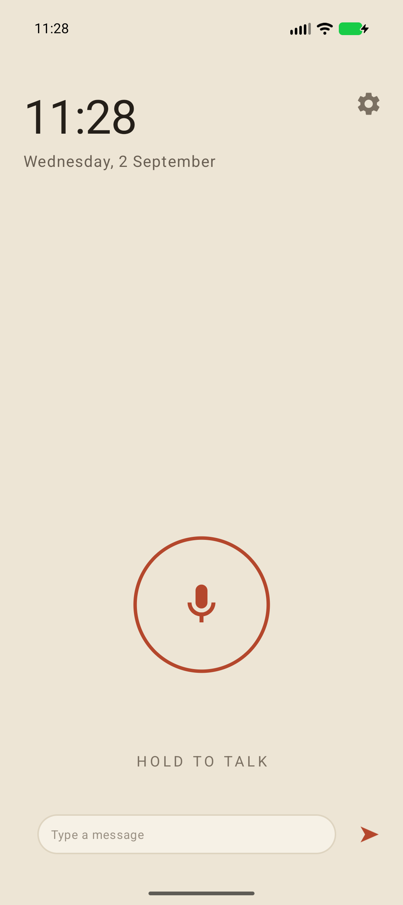
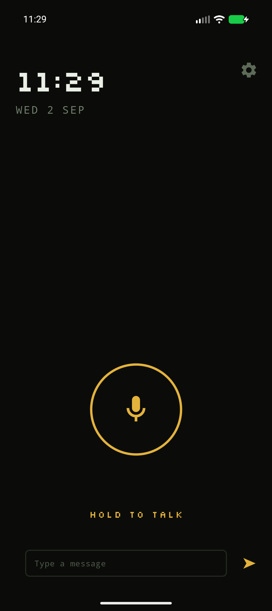
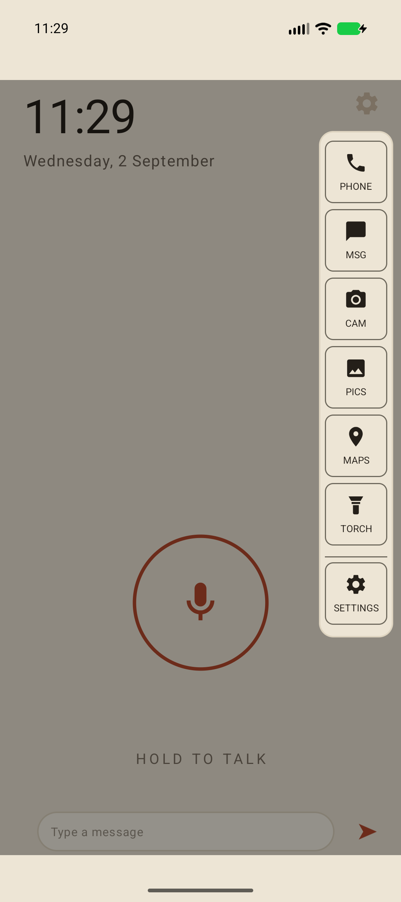

# RistOS: LLM assistant-first phone firmware for the Google Pixel 10a


### [⬇ Install RistOS on your Pixel 10a](image/INSTALL.md)

## What it is

A de-Googled phone OS built on GrapheneOS for Google Pixel 10a. It is a minimalist, assistant-first OS
designed to work with your own backend. It has a small fixed set of local apps including the phone, messages, camera,
gallery, offline maps, flashlight and settings, and nothing else. No app store, no browser, no feed,
no Google account, and no way to add anything.

Rist sells no phones and no service. If you already own a Pixel 10a, you flash this yourself.

| | | |
|:--:|:--:|:--:|
|  |  |  |

## How it works

```
[you] --push-to-talk / text--> [Rist app] --protobuf over HTTPS--> [your backend]
                                    ^                                   |
                                    +---- speech / views / commands <---+
```

- The app records speech only while you hold the button, and POSTs it (or typed text)
  to a backend endpoint as protobuf (`docs/BACKEND.md`).
- The backend replies with speech, text, views, or device commands.
- **Bring your own backend.** A public build has no endpoint compiled in and nothing to phone
  home to, so you set one on the device. See `docs/BACKEND.md`.

## Documentation
| Doc | What it answers |
|---|---|
| [image/INSTALL.md](image/INSTALL.md) | **installing it on a phone, step by step** |
| [SAFETY.md](SAFETY.md) | what can go wrong on a phone someone depends on — **read first** |
| [docs/BACKEND.md](docs/BACKEND.md) | **building a backend — start here, with a working example** |
| [docs/OTA.md](docs/OTA.md) | how updates reach a device |
| [CHANGELOG.md](CHANGELOG.md) | what each build does and does not do |
| [SECURITY.md](SECURITY.md) | reporting a vulnerability; known and accepted weaknesses |
| [BUILD.md](BUILD.md) | building the app, or the whole image, yourself |
| [TRADEMARKS.md](TRADEMARKS.md) | the code is yours to sell; the name is not — what a fork may call itself |
| [CONTRIBUTING.md](CONTRIBUTING.md) | what PRs are accepted, the pre-PR checklist, where bugs and questions go |

## Status and contributing

RistOS is pre-release and experimental. It supports the Google Pixel 10a only. There is no support
channel; bugs and questions go through the issue tracker. See [CONTRIBUTING.md](CONTRIBUTING.md) for
what is accepted and the pre-PR checklist.

## License, and the name

Apache-2.0 (see `LICENSE`, third-party attributions in `NOTICE`). The platform this builds on carries
its own licences, GPLv2 among them.

**The download redistributes Google's proprietary Pixel firmware, unmodified** — the bootloader and
the radio/modem images, plus the proprietary vendor files listed with their hashes in
`image/proprietary-files.txt`. Those remain Google's property and are governed by Google's terms,
not by this project's licence. Google, Pixel and Android are trademarks of Google LLC. RistOS is not
affiliated with, sponsored by, or endorsed by Google.

A modified build must not call itself RistOS; see `TRADEMARKS.md`.
